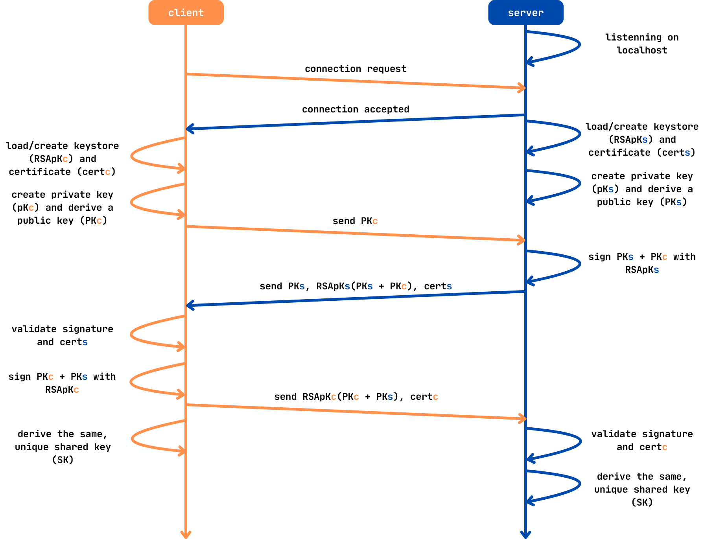
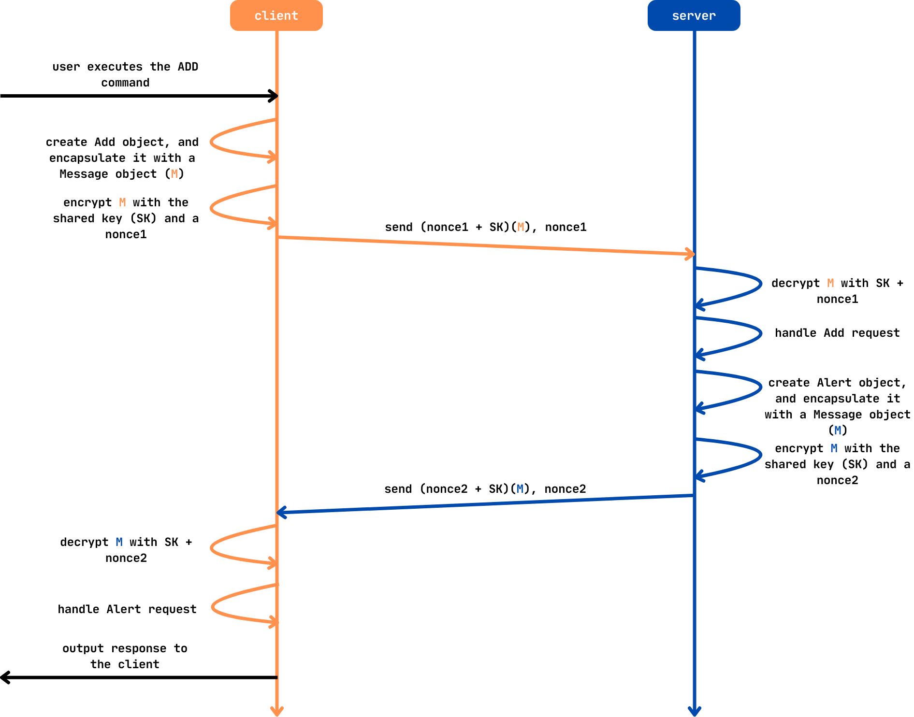

<h1 align="center">Cofre Seguro</h1>
<h1 align="center">Nota: 18/20</h1>

Realizado por:
- a99890 - [Edgar Ferreira](https://github.com/Edegare)
- a104353 - [Eduardo Faria](https://github.com/2101dudu)
- a104089 - [Nuno Silva](https://github.com/NunoMRS7)

## Índice
- [Descrição Geral](#descrição-geral)
- [Arquitetura](#arquitetura)
  - [Servidor](#servidor)
  - [Cliente](#cliente)
- [Segurança](#segurança)
  - [Comunicação Segura](#comunicação-segura)
  - [Confidencialidade dos Ficheiros](#confidencialidade-dos-ficheiros)
  - [Identificação e Credenciais dos Utilizadores](#identificação-e-credenciais-dos-utilizadores)
- [Funcionalidades](#funcionalidades)
  - [Comandos Implementados](#comandos-implementados)
- [Melhorias Implementadas](#melhorias-implementadas)
  - [Memória Persistente](#memória-persistente)
  - [Sistema de _Logs_](#sistema-de-logs)
  - [Interface _CLI-like_](#interface-cli-like)
  - [Autoridade Certificadora](#autoridade-certificadora)
  - [Avisos por ACKs](#avisos-por-acks)
- [Manual de Utilização](#manual-de-utilização)
  - [Configurar a Autoridade Certificadora](#configurar-a-autoridade-certificadora)
  - [Iniciar o Servidor](#iniciar-o-servidor)
  - [Iniciar o Cliente](#iniciar-o-cliente)
- [Conclusão](#conclusão)
- [Referências](#referências)


## Descrição Geral

Este projeto teve como objetivo desenvolver um serviço de cofre digital seguro que permita aos utilizadores armazenar, ler e partilhar ficheiros de texto de forma segura. O sistema garante a **confidencialidade**, **integridade** e **autenticidade** dos ficheiros partilhados, suportando a gestão de **utilizadores**, **grupos de utilizadores**, e **permissões**.

Para o programa oferecer um elevado nível de proteção de dados, foi absolutamente fundamental garantir uma comunicação cliente-servidor segura, assim como um armazenamento de ficheiros cifrado. As funcionalidades de segurança foram implementadas seguindo os conceitos abordados nas aulas práticas, utilizando **criptografia assimétrica** e **sistemas de chaves públicas** e **partilhadas**. Prevalece-se o uso de certificados **X.509** para autenticação e autorização dos utilizadores, garantindo que apenas os utilizadores autorizados possam aceder aos ficheiros armazenados.


## Arquitetura

### Servidor
O servidor tem como principal responsabilidade coordenar as operações entre clientes. Este abstrai a complexidade da gestão de ficheiros, grupos e permissões, permitindo que os clientes interajam com o sistema de forma simples e intuitiva. Algumas funcionalidades baseiam-se na noção de que _"[se] confia no servidor para efeitos da implementação dos aspectos funcionais do sistema, e em particular no que concerne à gestão do controlo de acessos."_


### Cliente
O cliente é a interface de interação do utilizador com o servidor. Este permite ao utilizador realizar as operações referentes a ficheiros, grupos e permissões. O cliente é responsável por enviar os pedidos ao servidor e processar as respostas recebidas, apresentando os resultados quando necessário.


## Segurança

### Comunicação Segura
Optámos por usar o protocolo **STS** baseado na troca de chaves **Diffie-Hellman** para estabelecer uma chave simétrica de forma segura, pois ele garante uma comunicação segura sem necessidade de um canal pré-estabelecido, embora existam alternativas como o protocolo **TLS 1.3** que seriam igualmente eficazes, mas mais complexas para o nosso contexto académico.

O protocolo **STS** permite que o cliente e o servidor estabeleçam uma **chave simétrica partilhada** sobre um canal inseguro. Além disso, utiliza **assinaturas digitais** e **certificados de chave pública** para garantir a autenticação mútua e proteger contra ataques do tipo **_man-in-the-middle_**.

O servidor e o cliente estabelecem uma ligação segura através de um _handshake_ inicial, onde trocam os seus **certificados X.509** e as **chaves públicas de Diffie-Hellman**. Após a verificação das assinaturas digitais e a validação dos certificados, ambas as partes autenticam-se mutuamente. A chave partilhada resultante do acordo de **Diffie-Hellman** é então usada como base para a derivação de chaves simétricas específicas para comunicação segura.

Para a serialização e desserialização das mensagens trocadas durante o protocolo, usámos o formato **BSON**, que permitiu uma conversão direta e eficiente entre as estruturas definidas no código e os dados transmitidos na comunicação.

<div align="center">  </div>

O grupo utilizou o mecanismo **HKDF** (**HMAC-based Extract-and-Expand Key Derivation Function**), apropriado para derivar múltiplas chaves simétricas seguras a partir da chave partilhada de **Diffie-Hellman**. Para garantir simultaneamente confidencialidade, integridade e autenticidade dos dados transmitidos, foi utilizado o modo de operação **AES-GCM** (**Galois Counter Mode**).

A escolha da cifra **AES-GCM** para cifragem de ficheiros foi feita pela sua eficiência e pela integração de autenticação, tornando-a uma solução robusta e de fácil implementação. No entanto, alternativas como o **ChaCha20-Poly1305** poderiam também ter sido consideradas dado a menor _overhead_ e a um maior desempenho em dispositivos com recursos limitados.

### Confidencialidade dos Ficheiros

Um percalço importante que o grupo teve de resolver foi a questão da **confidencialidade** dos ficheiros armazenados. Inicialmente, o servidor armazenava os ficheiros em texto puro, o que comprometia a segurança do sistema. Para resolver este problema, implementou-se um sistema de cifragem e decifragem dos ficheiros, garantindo que apenas os utilizadores autorizados possam aceder ao seu conteúdo. 

Um ficheiro associa, para cada utilizador que possui acesso, uma chave simétrica única. Esta possui os bytes resultantes da cifragem do **_nonce_ e a chave simétrica**, gerados durante a cifragem do ficheiro, com a **chave pública do utilizador**. 

Para tal, foi necessário escolher um sistema de chave pública adequado. Optámos por utilizar chaves **RSA** em vez de **ECC** ou **Ed25519** devido à sua maior compatibilidade com bibliotecas, ferramentas e protocolos existentes, facilitando a integração e o desenvolvimento. O **RSA** é um algoritmo **bem estabelecido e amplamente suportado**, o que reduz riscos de interoperabilidade. Embora alternativas como **ECC** ou **Ed25519** ofereçam melhor desempenho e segurança com chaves menores, a **simplicidade e fiabilidade** do **RSA** tornaram-no a escolha mais prática para esta implementação.


### Identificação e Credenciais dos Utilizadores
Cada utilizador é identificado por um certificado **X.509**, contendo, pelo menos, os atributos `PSEUDONYM` (ID único), `CN` (ID único) e `OU` ("G10 SSI USER VAULT SERVICE"). O servidor e os clientes utilizam _keystores_ do padrão **PKCS#12** para armazenar certificados e chaves privadas num ficheiro `.p12`. Os ficheiros `.p12` são cifrados com uma senha, que deve ser fornecida pelo utilizador para aceder ao sistema.


## Funcionalidades

Todos os comandos implementados foram idealizados com uma elevada robustez e segurança em mente, garantindo que os detalhes especificados para cada operação fossem respeitados.

Exemplo do funcionamento do comando `add`:

<div align="center">  </div>

### Comandos Implementados

- `add <file-path>`: Adiciona um ficheiro ao cofre pessoal. Este ficheiro é cifrado com a operação **AES-GCM** através de uma chave simétrica aleatória **AES-GCM**. A chave e o _nonce_ gerados são, então, cifrados com a **chave pública RSA** do cliente (extraída a partir do certificado digital do cliente), e ambos os dados são enviados e armazenados no servidor.
     
- `read <file-id>`: Lê o conteúdo de um ficheiro armazenado no cofre pessoal. Para isso, o cliente começa por decifrar a chave simétrica AES-GCM e o respetivo _nonce_, que se encontram cifrados com a sua **chave pública RSA**. Esta decifragem é feita localmente com a chave privada RSA do cliente. Uma vez obtidos a chave e o _nonce_ originais, o conteúdo do ficheiro é decifrado com a operação **AES-GCM**, restaurando assim os dados originais.

- `delete <file-id>`: Remove o ficheiro globalmente se for o dono; caso contrário, revoga o acesso do utilizador ao ficheiro.  

- `replace <file-id> <file-path>`: Substitui o conteúdo de um ficheiro já existente por um novo ficheiro localizado no caminho indicado. O novo conteúdo é cifrado utilizando o mesmo mecanismo de proteção original: é gerada uma nova chave simétrica **AES-GCM** e um novo _nonce_, que são utilizados para cifrar o novo conteúdo. Em seguida, a chave simétrica e o _nonce_ são cifrados com a(s) chave(s) pública(s) previamente associada(s) ao ficheiro (do proprietário, utilizadores com quem o ficheiro foi partilhado, ou membros de um grupo). O ficheiro cifrado e os novos dados de cifragem substituem os anteriores no servidor.

- `details <file-id>`: Lista os detalhes de um ficheiro.

- `revoke <file-id> <user-id>`: Revoga as permissões de um utilizador sobre um ficheiro. Só é possível pelo dono do ficheiro.

- `share <file-id> <user-id> <permission>`: Partilha um ficheiro com outro utilizador, sendo esta operação exclusiva do dono do ficheiro. Para isso, o cliente começa por solicitar ao servidor o conteúdo cifrado do ficheiro, bem como a chave e o _nonce_ cifrados com a sua **chave pública RSA**, além da **chave pública RSA** (proveniente do certificado digital) do utilizador com quem irá partilhar o ficheiro. Após decifrar a chave e o _nonce_ com a sua **chave privada RSA**, o cliente reencifra o conteúdo do ficheiro com uma nova chave simétrica **AES-GCM** e um novo _nonce_, que são por sua vez cifrados com a **chave pública RSA do utilizador destinatário**. Estes dados são então enviados para o servidor para que o outro utilizador possa aceder ao ficheiro de forma segura.

- `list [-u <user-id> | -g <group-id>]`: Lista ficheiros disponíveis para acesso de um utilizador ou grupo.

- `group create <group-name>`: Cria um grupo.

- `group delete <group-id>`: Apaga um grupo e remove as permissões dos seus membros sobre os ficheiros do grupo.

- `group details <group-id>`: Lista os detalhes de um grupo.

- `group add-user <group-id> <user-id> <permissions>`: Adiciona um utilizador a um grupo, atribuindo-lhe permissões de leitura e/ou escrita dentro do grupo. Apenas é possível ser executado pelo dono do grupo. Quando um novo utilizador é adicionado com permissões de leitura, ganha acesso a todos os ficheiros previamente associados ao grupo. Para isso, o servidor envia ao dono do grupo, para cada ficheiro, a chave simétrica e o _nonce_ cifrados com a sua chave pública, permitindo-lhe decifrar o conteúdo. Em seguida, o dono do grupo recifra a chave e o _nonce_ com a chave pública do novo membro, garantindo-lhe assim acesso aos ficheiros já existentes.


- `group delete-user <group-id> <user-id>`: Remove um utilizador de um grupo. Em implementações seguras de controlo de acesso, a remoção de um membro implicaria a revogação da sua capacidade de desencriptar ficheiros previamente partilhados, o que requereria a geração de uma nova chave simétrica (e respetivo _nonce_) para cada ficheiro, a re-encriptação dos conteúdos, e a redistribuição segura das novas chaves para os membros restantes. No entanto, nesta implementação, assume-se um modelo de servidor confiável e, por motivos de simplicidade, não é realizada qualquer rotação de chaves. O utilizador é simplesmente removido da lista de membros e todas as suas permissões associadas ao grupo são revogadas.

- `group list`: Lista os grupos aos quais o utilizador pertence.

- `group add <group-id> <file-path>`: Adiciona um ficheiro ao cofre do grupo. O cliente começa por solicitar ao servidor a lista dos membros do grupo, juntamente com as respetivas **chaves públicas RSA** (extraídas dos certificados digitais de cada utilizador). Em seguida, o cliente gera uma chave simétrica **AES-GCM** e um _nonce_ para cifrar o conteúdo do ficheiro. Esta chave e _nonce_ são depois cifrados individualmente com a chave pública RSA de **cada membro do grupo**. O ficheiro cifrado, juntamente com os pares chave/_nonce_ cifrados por utilizador, é então enviado para o servidor, permitindo que todos os membros autorizados possam posteriormente decifrar e aceder ao ficheiro.

- `help`: Mostra a lista de comandos disponíveis. 

- `exit`: Termina a sessão do cliente.

- `clear`: Limpa o ecrã do terminal.


## Melhorias Implementadas

Durante o desenvolvimento do projeto, o nosso grupo identificou várias oportunidades para tornar o sistema mais robusto, funcional e amigável para o utilizador. Neste sentido, implementamos diversas melhorias que, embora não exigidas, considerámos essenciais para um projeto mais completo.

### Memória Persistente

Decidimos utilizar **BSON** para persistência de dados entre execuções do servidor, uma escolha prática e eficiente em comparação com bases de dados relacionais, dado que o objetivo era manter o projeto simples e focado em funcionalidade. Em um sistema real, uma solução mais escalável, como uma base de dados **SQL**, seria mais apropriada.

O seu funcionamento é simples e eficaz:

- **Ao iniciar o servidor**, os dados são carregados do ficheiro `out/db.bin` (caso exista) e, posteriormente, desserializados, restaurando o estado anterior.
- **Ao terminar o servidor**, o estado atual é serializado nos respetivos dicionários de utilizadores, grupos e ficheiros, e guardado no mesmo ficheiro.

Este mecanismo aumentou significativamente a fiabilidade e a continuidade do sistema, aproximando-o de um ambiente de produção real.

É de notar que o servidor pode ser configurado com a flag `-n` para não utilizar a memória persistente, iniciando uma nova sessão sem dados anteriores. Independente da configuração, o servidor guarda sempre os dados no ficheiro `out/db.bin` ao terminar.


### Sistema de _Logs_

Para fornecer capacidades de monitorização e auditoria ao sistema, implementámos um sistema de **_logs_** que regista as operações realizadas pelos utilizadores. Este sistema é fundamental para a detecção de comportamentos anómalos e para a análise de possíveis falhas.

No que toca ao sistema de _logs_, o servidor, ao iniciar, pode ser configurado com diferentes _flags_ que controlam a **verbosidade** dos _logs_ e a sua **exibição na consola**. Independentemente da configuração, os _logs_ são sempre gravados num ficheiro de texto, contendo um _timestamp_ para cada entrada. Assim, este ficheiro armazena **todas as execuçoes realizadas no servidor**, permitindo uma análise histórica completa e detalhada.

### Interface _CLI-like_

O refinamento da interface simples de linha de comandos (CLI) foi uma excelente maneira de agilizar a execução de comandos. A interface CLI-like permite ao utilizador utilizar o **TAB para autocompletar** os comandos disponíveis, **limpar o ecrã** com o comando `clear`, e navegar entre os **histórico de comandos** com as setas para cima e para baixo.

### Autoridade Certificadora

O programa foi inicialmente desenvolvido com a premissa de que os utilizadores teriam de gerar os seus próprios certificados e chaves privadas, o que revelava um problema grave de escalabilidade. Para resolver este problema, decidimos implementar uma **Autoridade Certificadora (CA)** própria no sistema.

A CA é responsável por receber **_Certificate Signing Requests_** (**CSR**) para gerar os certificados dos utilizadores (cliente ou servidor) e assinar os mesmos. O solicitante do certificado é responsável por gerar o seu próprio par de chaves e o respetivo CSR assinado pela chave privada, que é enviado para a CA. Esta, por sua vez, valida a chave privada incluída no CSR e devolve o certificado ao cliente.

Assim, assumindo que a CA é de confiança e que emite certificados a utilizadores legítimos, tanto o cliente como o servidor podem confiar que foi estabelecida uma ligação segura, validada pela CA.


### Avisos por ACKs

Para melhorar a comunicação entre o cliente e o servidor e garantir uma melhor usabilidade e depuração, decidimos implementar um sistema de **mensagens de aviso (ACKs)**. Esta funcionalidade visa melhorar a experiência do utilizador, fornecendo feedback imediato sobre o sucesso ou falha de cada operação.

Sendo assim, definimos dois tipos de mensagens de aviso:

- `SUCCESS`: Indica que a operação foi concluída com sucesso (e.g., partilha de ficheiro realizada, utilizador adicionado a grupo).
- `ERROR`: Indica que a operação falhou por algum motivo especificado na mensagem (e.g., identificador inválido, falta de permissões, utilizador inexistente).


## Manual de Utilização

### Configurar a Autoridade Certificadora

A partir da raiz do repositório:
1. Navegue até à pasta `trabalho-pratico`:
    ```bash
    cd trabalho-pratico
    ```
2. Execute o seguinte comando para ativar a CA:
    ```bash
    python3 -m ca.ca
    ```

---

1. Noutro terminal, navegue até à pasta `trabalho-pratico`:
    ```bash
    cd trabalho-pratico
    ```
2. Execute o seguinte comando para obter o certificado da CA:
    ```bash
    openssl pkcs12 -in ca/ca.p12 -clcerts -nokeys -out crt/ca.crt
    ```

### Iniciar o Servidor
A partir da raiz do repositório, e num novo terminal:
1. Navegue até à pasta `trabalho-pratico`:
    ```bash
    cd trabalho-pratico
    ```
2. Execute o seguinte comando para ativar o servidor:
    ```bash
    python3 -m server.server [-h] [-p] [-l {0,1}] [-n]
    ```

### Iniciar o Cliente
A partir da raiz do repositório, e num novo terminal:
1. Navegue até à pasta `trabalho-pratico`:
    ```bash
    cd trabalho-pratico
    ```
2. Execute o seguinte comando para ativar uma instância de cliente:
    ```bash
    python3 -m client.client
    ```

## Conclusão

O projeto atingiu os objetivos principais: o grupo construiu um canal de **comunicação seguro ponto-a-ponto**, **cifrou os ficheiros** com uma chave simétrica **Diffie‑Hellman** derivada via **HKDF** e protegida por **AES‑GCM**, e automatizou a gestão de certificados com uma **Autoridade Certificadora interna**. A **CLI** ficou **ágil e intuitiva**, com autocompletar, histórico e **mensagens de ACK** que tornam o uso fluído. O grupo utilizou **memória persistente** para guardar o estado da aplicação entre execuções, e o registo de operações e logs garante persistência e rastreabilidade sem grandes dependências externas.

Por outro lado, há espaço para reforçar o sistema: o grupo poderia ter implementado **rotação de chaves** para **revogações de grupo** em vez de confiar cegamente no servidor, adotado protocolos mais modernos (**ChaCha20‑Poly1305**, **ECC** ou **TLS 1.3**) para otimizar desempenho e simplificar _handshakes_, e migrado a persistência para uma base de dados dedicada para **melhor escalabilidade** e consultas avançadas. Além disso, a adição de **testes automatizados** e de uma **interface gráfica** expandiria a robustez e a usabilidade do cofre seguro.

## Referências

https://pypi.org/project/bson/

https://cryptography.io/en/latest/x509/

https://python-prompt-toolkit.readthedocs.io/en/master/

https://en.wikipedia.org/wiki/Station-to-Station_protocol

https://cryptography.io/en/stable/hazmat/primitives/key-derivation-functions/#hkdf

https://cryptography.io/en/latest/hazmat/primitives/aead/#cryptography.hazmat.primitives.ciphers.aead.AESGCM

https://cryptography.io/en/latest/hazmat/primitives/asymmetric/ed25519/
